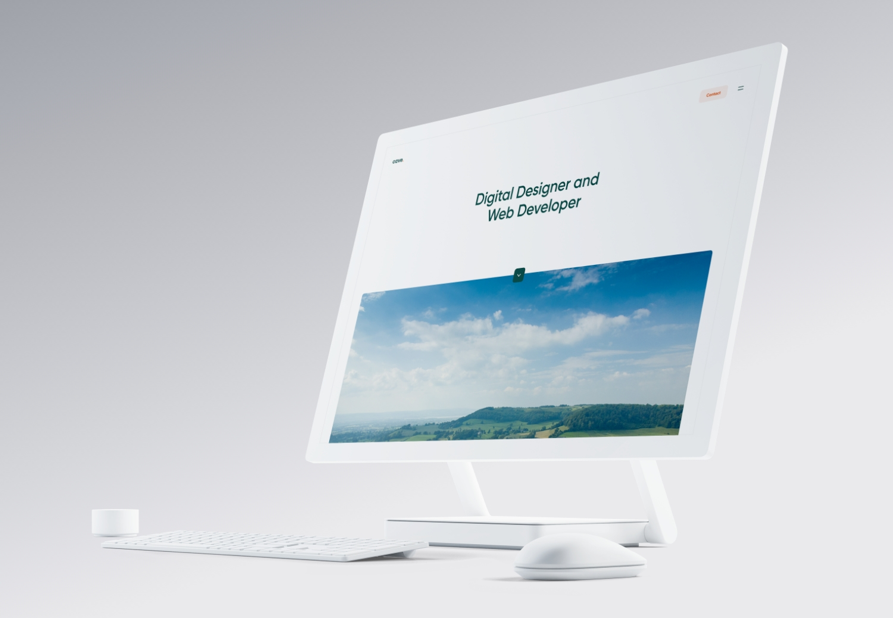

# Personal Website

A personal portfolio website for all some of my creative and development projects. I wanted to make sure this website has a personal touch to it, instead of being a generic portfolio website like any other.


It was built using the web application framework for NodeJS, called Express and then using Handlebars for the templating engine to render out each of the project pages. All of the project data is located inside a JSON file that acts as the database for the website.





## Getting Started

The get this project up and running, just simply follow the instructions below or [visit the website here](https://nickcave.co/).

### Prerequisites

* Modern web browser
* Internet connection
* NodeJS
* NPM

### Installing

Here's how to get it running.

Clone the git repo

```
git glone https://github.com/enarsinick/personal-website.git
```

Install all the dependencies

```
npm install
```

Start the development server

```
npm start
```


## Built With

* [NodeJS](https://nodejs.org/en/)
* [Express](https://expressjs.com/)
* [Express Handlebars](https://www.npmjs.com/package/express-handlebars)
* [SASS](https://sass-lang.com/)
